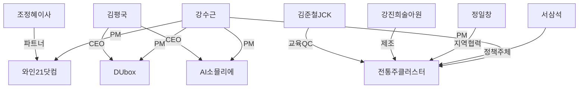

# 👥 핵심 관계자 네트워크

## 내부 팀

| 이름 | 조직 | 역할 | 관련 프로젝트 |
|------|------|------|-------------|
| 강수근 (본인) | 디유넷/DIT | 프로젝트 PM, 기획·분석 총괄 | 와인21, DUbox, 전통주, AI소믈리에 전체 |
| 김평국 | 디유넷(DUnet) 대표 | 사업 총괄 CEO | DUbox, AI소믈리에 |

## 파트너 — 와인21닷컴

| 이름 | 조직 | 역할 | 메모 |
|------|------|------|------|
| 조정혜 이사 | 와인21닷컴 | 전략적 제휴 협의창구 | 2025-05-27 미팅 |
| (미확인) | 와인21닷컴 | 데이터 자산 보유 | 3만여 종 와인 DB, 70개 수입사 네트워크 |

## 파트너 — 결제/POS

| 이름 | 조직 | 역할 | 메모 |
|------|------|------|------|
| 김기민 상무 | KCP | 결제 인프라 협력 | 2025-06-26 미팅 |
| (미확인) | 토스페이먼츠 | PG/결제 솔루션 | 2025-07-16 미팅 |

## 파트너 — 전통주/증류주 클러스터

| 이름 | 조직 | 역할 | 메모 |
|------|------|------|------|
| 서삼석 | 국회의원 (영암·무안·신안) | 정책 주체, 국비 예산 확보 | 농림축산식품해양수산위 |
| 정일창 | 무안 지역 부회장급 | 지역 실행 주체, 사업 추진 협력 | 2026-03-03 회의 |
| 강진희 | 술아원 농업법인 대표 | 증류주 양조·체험 운영 | 6차산업 인증, 찾아가는 양조장 |
| 김준철 | JCK 와인스쿨 원장 | QC·교육·자문 | 와인/증류주 전문가 |
| 전영욱 | 주류 대기업 수석연구원 | 양조 기술 자문 | |

## 파트너 — DUbox

| 이름 | 조직 | 역할 | 메모 |
|------|------|------|------|
| (미확인) | 토스 | AML/FDS, 결제 | 2024-06 미팅 |
| (미확인) | 할리스커피 | 시범사업 파트너 | 스마트오더 PoC |

## 관계자 네트워크 맵

> [!tip] 업데이트 방법
> 새 미팅 또는 파트너가 생기면 이 노트에 행을 추가하고, 관련 프로젝트 요약 노트도 함께 업데이트하세요.
